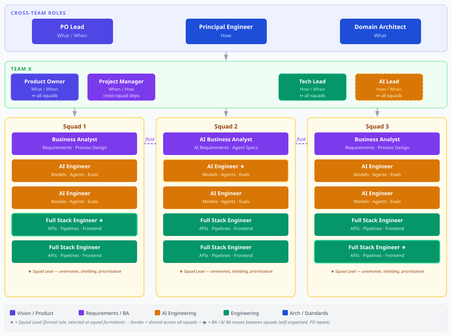

# _local-bdr-401: Product team roles and composition

## Context and Problem Statement

Product teams operate across diverse domains — internal APIs, customer-facing business processes, and shared platforms. Without a clear definition of each role's responsibilities, boundaries, and expected skills, teams accumulate ambiguity about who owns what, leading to gaps in coverage, duplicated effort, and unclear escalation paths.

What roles make up a product team, what does each role own, and how should teams be structured to operate effectively?

## Decision Outcome

**A defined set of cross-team and team-level roles with explicit responsibilities, skill requirements, and composition models, including known structural gaps and their mitigations**

### Details

#### 01-product-team-purpose

A product team is responsible for a product consumed by others: an API used by another team in the company, a business process used by customers, or a platform that other teams build on.

Strategic objectives typically originate outside the team. However, the team must own a defined set of OKRs or KPIs and be fully autonomous within its domain to change processes and implement systems that affect those objectives. The team is accountable for results within its domain; it does not depend on other teams to execute changes within scope.

#### 02-product-team-scope-of-work

The team owns the full lifecycle of its product:

- Model as-is business processes and define to-be target processes
- Design architecture and system components
- Implement and deploy features across all environments
- Test software components, runtime services, and business processes
- Monitor production operation
- Fix incidents and manage production stability
- Communicate outages and new feature rollouts to users

The team must not hand off any of these responsibilities to a separate function. Ownership is end-to-end.

#### 03-workforce-allocation

Teams must allocate available capacity across three categories. These are targets, not rigid weekly quotas — they should balance over a rolling 4–6 week window:

| Category | Target | Scope |
|---|---|---|
| New features | 50% | Spiking, designing, implementing, and testing new capabilities |
| Tech and cognitive debt | 25% | Reducing complexity, improving maintainability, resolving known deficiencies |
| Operations and controls | 25% | Monitoring, incident response, compliance checks, access reviews, process audits |

#### 04-roles-overview

| Role | Scope | Focus |
|---|---|---|
| PO Lead | Cross-team | What / When |
| Principal Engineer | Cross-team | How |
| Domain Architect | Cross-team | What |
| Product Owner (PO) | Team | What / When |
| Project Manager (PM) | Team | When / How |
| Business Analyst (BA) | Team / Squad | What / How |
| AI Business Analyst (AI BA) | Team / Squad | What / How |
| AI Lead | Team / Squad | How / When |
| AI Engineer | Squad | How |
| Tech Lead | Team / Squad | How / When |
| Full Stack Engineer | Squad | How |

#### 05-cross-team-roles

The following roles operate across all product teams within a domain. They do not belong to a single team.

---

**PO Lead**

*Purpose*: Maintain overarching tactical vision and priority alignment across all product teams. Acts as the senior escalation path for cross-team priority conflicts.

*Responsibilities*:
- Define higher-level OKRs that span multiple product teams
- Maintain visibility into each team's product vision and sprint priorities
- Arbitrate priority ordering when teams have conflicting dependencies or competing goals
- Communicate strategic direction to team-level Product Owners

*Authority*: Not a line manager. Teams retain full operational autonomy. The PO Lead's authority is limited to deciding priority ordering when teams cannot resolve cross-team conflicts themselves.

*Soft skills*: Strategic thinking, stakeholder communication, conflict resolution, big-picture prioritisation, influence without authority

*Hard skills*: OKR methodology, product roadmap management, backlog and dependency management across multiple teams

*Common activities*: Cross-team prioritisation meetings, OKR reviews, dependency mapping, Product Owner syncs, escalation handling

---

**Principal Engineer**

*Purpose*: Own the HOW across all product teams — engineering practices, tooling standards, platform choices, and AI practices — and synthesise them into a blueprint that leads can apply.

*Responsibilities*:
- Define and maintain engineering standards across all product teams (coding practices, testing, CI/CD, observability)
- Select and standardise platforms and tooling used by teams
- Shape AI engineering practices and the adoption of AI-assisted development
- Connect architecture decisions, business requirements, and standardised platforms into a coherent engineering blueprint
- Mentor Tech Leads and AI Leads on standards and practices

*Soft skills*: Technical leadership, communication across skill levels, systems thinking, mentoring, cross-team influence

*Hard skills*: Software architecture, platform engineering, AI/ML practices, CI/CD, observability, security engineering, developer experience

*Common activities*: Engineering standards authoring, tech radar reviews, architecture and platform reviews, Tech Lead and AI Lead mentoring sessions, cross-team engineering syncs

---

**Domain Architect**

*Purpose*: Own the WHAT at the domain level — how all applications and systems interact, what the main business processes are, and how platforms are used across the domain.

*Responsibilities*:
- Define and maintain the overarching architecture for the domain, including application interaction models
- Author blueprints for adopted platforms and their usage patterns
- Map main business processes and their relationships to applications
- Ensure architectural consistency across product teams within the domain

*Soft skills*: Holistic thinking, stakeholder communication, structured documentation, facilitation

*Hard skills*: Enterprise architecture, business process modelling, integration patterns, platform architecture, domain-driven design

*Common activities*: Domain architecture diagrams, blueprint authoring, business process mapping, architecture review participation, cross-team design alignment sessions

#### 06-team-roles

The following roles belong to a product team. Some roles are shared across squads within the team; others are dedicated to a squad.

---

**Product Owner (PO)**

*Purpose*: Own the product vision for the team's scope, define sprint goals, and ensure team priorities align with broader OKRs.

*Responsibilities*:
- Define and maintain the product vision for the team
- Set sprint goals and prioritise the team backlog
- Align team-level OKRs with PO Lead direction
- Accept or reject completed work against acceptance criteria
- Communicate product direction to stakeholders and team members

*Shared across squads*: Yes — the PO connects to all squads in the team.

*Soft skills*: Vision articulation, prioritisation under uncertainty, stakeholder management, decisiveness, facilitation

*Hard skills*: Backlog management, OKR definition and tracking, user story writing, roadmap planning, basic domain knowledge of the product area

*Common activities*: Sprint planning, backlog refinement, sprint reviews, stakeholder presentations, OKR reviews, acceptance testing participation

---

**Project Manager (PM)**

*Purpose*: Own stakeholder management, reporting, and cross-team coordination. Proactively unblock the team by connecting priorities and people across organisational boundaries.

*Responsibilities*:
- Manage relationships with external stakeholders and report on progress
- Identify and resolve cross-team dependencies and scheduling conflicts before they block delivery
- Coordinate cross-squad dependencies within the team
- Track risks, assumptions, issues, and dependencies (RAID)
- Facilitate communication between the team and external parties

*Authority*: No authority over technical or product decisions. Facilitates and connects; does not override PO or Tech Lead decisions.

*Soft skills*: Communication, relationship management, proactive problem-solving, negotiation, organisation, cross-team coordination

*Hard skills*: Project planning, risk management, reporting, dependency tracking, facilitation, RAID log management

*Common activities*: Stakeholder updates, dependency mapping sessions, risk reviews, cross-team syncs, status reporting, escalation facilitation

---

**Business Analyst (BA)**

*Purpose*: Understand what needs to be built and translate business problems into clear, implementable requirements for non-AI features and processes.

*Responsibilities*:
- Research business problems through stakeholder interviews, process observation, and analysis
- Model as-is and design to-be business processes
- Define system requirements at requirement level: data inputs/outputs, business rules, human interactions, and external dependencies
- Write user stories and acceptance criteria at a level implementable within a few days
- Support engineers during implementation by clarifying requirements

*Squad assignment*: Ideally one BA per squad, working ahead on upcoming features while available for in-sprint requirement clarification. May move between squads when demand shifts (self-organised with PO awareness).

*Soft skills*: Curiosity, structured thinking, stakeholder communication, facilitation, attention to detail

*Hard skills*: Business process modelling (BPMN or equivalent), requirements writing, user story authoring, process analysis, data mapping

*Common activities*: Stakeholder interviews, process workshops, requirements documentation, backlog refinement support, acceptance criteria authoring, sprint demo observation

---

**AI Business Analyst (AI BA)**

*Purpose*: Define what needs to be built for AI-powered solutions by translating business needs into clear, implementable AI requirements — covering workflows, agents, models, integrations, controls, and test criteria.

*Responsibilities*:
- Research business problems through analysis, stakeholder interviews, and process discovery
- Design target business processes, AI workflows, agents, models, and required system integrations
- Identify AI opportunities, risks, controls, and regulatory requirements
- Define data inputs, outputs, business rules, human interactions, and external dependencies for AI systems
- Specify which models, agents, and workflows need to be implemented, and the detailed input/output of all internal and external systems involved
- Create detailed user stories and acceptance criteria that engineers can implement within a few days
- Define test and evaluation requirements for AI systems

*Research boundary*: The AI BA researches business problems, requirements, and AI opportunities before implementation begins. The AI Engineer researches technical approaches, model selection, data characteristics, and evaluation methods during implementation. These boundaries must not blur.

*Squad assignment*: Same mobility rules as BA. AI BA and BA may exchange squad positions depending on which phase the squad is in and whether AI or non-AI features dominate.

*Accountability*: The AI BA owns WHAT is required — business requirements, AI workflows, data definitions, controls, and acceptance criteria. Engineering teams own HOW the solution is implemented, including architecture, technology choices, infrastructure, security, and deployment.

*Deliverables*: Business and AI requirements, process and workflow designs, AI agent and model specifications, integration and data requirements, risk and control assessments, test and evaluation requirements for AI systems, epics, features, and user stories

*Soft skills*: Curiosity about AI capabilities and limits, structured thinking, stakeholder communication, ability to bridge business and technical language, attention to regulatory and ethical risk

*Hard skills*: AI system design, prompt engineering concepts, AI workflow and agent specification, business process modelling, requirements writing, data input/output definition, AI risk and control frameworks, regulatory awareness (EU AI Act, sector-specific rules)

*Common activities*: AI opportunity workshops, stakeholder interviews, AI workflow design, agent specification authoring, risk and control assessment, acceptance criteria for AI outputs, backlog refinement support

---

**AI Lead**

*Purpose*: Own the technical design of AI implementations within the team — architectures, platforms, implementation order, and output quality standards — and develop AI engineers through mentoring and pairing.

*Responsibilities*:
- Design the technical architecture for tests, models, agents, and workflows
- Define implementation platforms and tooling for AI development
- Sequence AI implementation work and define quality and monitoring standards for AI outputs
- Refine user stories related to AI development with sufficient technical detail
- Mentor AI Engineers through pairing, code review, and knowledge sharing
- Co-design integrated features with Tech Lead (tiebreaker on AI component decisions)

*Shared across squads*: Yes — the AI Lead connects to all squads in the team.

*Soft skills*: Technical leadership, mentoring, clear communication of complex AI concepts, cross-functional collaboration, pragmatic decision-making

*Hard skills*: ML/AI system architecture, LLM and agent frameworks, model evaluation and observability, MLOps, prompt engineering, AI safety and testing practices, Python, relevant ML libraries

*Common activities*: AI architecture design sessions, technical story refinement, AI code reviews, pairing sessions with AI Engineers, model evaluation design, cross-lead technical alignment with Tech Lead

---

**AI Engineer**

*Purpose*: Implement AI components — tests, models, agents, and workflows — according to the technical design provided by the AI Lead.

*Responsibilities*:
- Implement models, agents, and AI workflows to specification
- Build evaluations (evals), regression tests, and datasets for AI systems
- Research technical approaches, model selection, data characteristics, and evaluation methods during implementation (not business requirements — that is AI BA scope)
- Perform data analysis to support model development and evaluation
- Raise technical blockers and edge cases to the AI Lead

*Soft skills*: Curiosity, structured problem-solving, willingness to experiment and discard, attention to evaluation rigour

*Hard skills*: Python, ML frameworks (PyTorch, scikit-learn, or equivalent), LLM and agent frameworks (LangChain, LangGraph, or equivalent), prompt engineering, evaluation design, data analysis, experiment tracking

*Common activities*: Model and agent implementation, eval authoring, dataset creation and curation, data analysis, technical research, code review participation, pairing with AI Lead

---

**Tech Lead**

*Purpose*: Own the technical design of non-AI implementations — services, choreographers, web pages, app pages, CI/CD, monitoring, and incident procedures — and develop engineers through mentoring and pairing.

*Responsibilities*:
- Design technical architecture for services, choreographers, web pages, and mobile app pages
- Define monitoring, alerting, and Change Management procedures integrated with CI/CD
- Define and maintain Incident Management procedures
- Sequence engineering implementation work
- Refine user stories related to engineering with sufficient technical detail
- Mentor Full Stack Engineers through pairing, code review, and knowledge sharing
- Co-design integrated features with AI Lead (tiebreaker on system boundary decisions)

*Shared across squads*: Yes — the Tech Lead connects to all squads in the team.

*Soft skills*: Technical leadership, mentoring, structured communication, cross-functional collaboration, pragmatic decision-making under uncertainty

*Hard skills*: Software architecture, API design, event-driven systems, CI/CD pipelines, observability and alerting, incident management, security engineering basics, relevant languages and frameworks used by the team

*Common activities*: Architecture design sessions, technical story refinement, code reviews, pairing sessions with Full Stack Engineers, incident post-mortems, CI/CD pipeline design, cross-lead technical alignment with AI Lead

---

**Full Stack Engineer**

*Purpose*: Implement non-AI software components — CI/CD pipelines, connectors, platforms, workflows, web pages, mobile apps, scripts, APIs, database access, and event-based flows. Also bridges knowledge gaps with AI Engineers when needed.

*Responsibilities*:
- Implement services, APIs, database access layers, event-based flows, and non-AI workflows
- Build and maintain CI/CD pipelines
- Implement web pages, mobile app screens, and frontend components
- Write and maintain scripts and automation for platform and operational needs
- Support AI Engineers with software engineering knowledge gaps (e.g., API integration, data pipelines, infrastructure)

*Soft skills*: Breadth of technical knowledge, pragmatism, collaborative problem-solving, ownership of delivered quality

*Hard skills*: Full stack development (frontend and backend), API design and implementation, database access (SQL and NoSQL), event-driven systems, CI/CD tooling, containerisation, scripting, mobile development (where applicable)

*Common activities*: Feature implementation, API and data layer development, CI/CD pipeline work, code review participation, pairing with AI Engineers, frontend development, incident support

#### 07-team-composition-simple

A simple team handles a bounded product scope with limited AI surface. It requires no squads.

| Role | Count |
|---|---|
| Product Owner | 1 |
| Business Analyst or AI BA | 1 |
| Tech Lead | 1 |
| Full Stack Engineer | 1–2 |
| AI Engineer (if AI work exists) | 0–1 |

The Tech Lead may also contribute as an engineer in small teams. The BA works directly with the PO on requirements without squad separation.

#### 08-team-composition-complex

A complex team handles a broad product scope or significant AI surface and operates with internal squads to manage parallelism.

| Role | Count | Notes |
|---|---|---|
| Product Owner | 1 | Shared across all squads |
| Tech Lead | 1 | Shared across all squads |
| AI Lead | 1 | Shared across all squads |
| Squad | 3 | See squad composition below |

**Squad composition** (per squad):

| Role | Count | Notes |
|---|---|---|
| Business Analyst (BA or AI BA) | 1 | Ideally one per squad; may move |
| AI Engineer | 2 | |
| Full Stack Engineer | 2 | |
| Squad Lead | 1 | One of the engineers above, designated by soft skills |

Maximum of 4 engineers (AI + Full Stack combined) per squad to preserve team cohesion and limit coordination overhead.

#### 09-squad-dynamics

**Squad stability**: Engineers assigned to a squad must remain stable over time. Frequent reassignment prevents team bonding and reduces squad effectiveness. Squad membership changes should be deliberate and infrequent.

**BA and AI BA fluidity**: One BA or AI BA should be assigned to each squad, ideally working one sprint ahead on upcoming features. When squad needs shift — for example, when a squad moves from a non-AI phase to an AI-heavy phase — the BA and AI BA may exchange positions. Movement is self-organised between the BAs with PO awareness. There is no restriction to sprint boundaries.

**Squad Lead**: Each squad must have a designated Squad Lead — one of its engineers (AI Engineer or Full Stack Engineer) selected based on available soft skills. The Squad Lead is a formal role with the following responsibilities:
- Run squad ceremonies (standups, retrospectives)
- Shield the squad from unplanned external interruptions
- Make within-squad prioritisation calls when the PO or Tech Lead / AI Lead are unavailable

The Squad Lead must be identified at squad formation, not selected on-demand when a situation arises. The role does not change the engineer's technical responsibilities and does not carry a formal seniority change, but soft skills must be taken into account at the time of assignment.

**Cross-squad coordination**: Cross-squad dependencies within the same team are the PM's explicit responsibility. The PM proactively identifies and resolves scheduling conflicts between squads.

**Tech Lead and AI Lead interaction**: The PO, Tech Lead, and AI Lead connect to all squads. For integrated features that span AI and non-AI components, the Tech Lead and AI Lead co-own the technical design. The Tech Lead holds the tiebreaker on system boundaries and non-AI components; the AI Lead holds the tiebreaker on AI components.

#### 10-known-gaps-and-mitigations

This team model has known structural gaps. Teams must be aware of them and apply the recommended mitigations proactively.

| Gap | Risk | Mitigation |
|---|---|---|
| PO, Tech Lead, AI Lead spanning 3 squads | Bandwidth overload; leads become bottlenecks for decisions and unblocking | Squad Lead absorbs daily unblocking and within-squad prioritisation; leads focus on design, mentoring, and cross-squad alignment |
| Principal Engineer covering all teams | Single point of knowledge for engineering standards | Architecture documentation kept current; Principal Engineer actively pairs with Tech Leads and AI Leads to distribute knowledge |
| No UX/Design role | UI and interaction design absorbed informally by BA or PO | Bring in a contract designer for user-facing features with significant interaction design needs |
| No Data Engineering / MLOps role | Data pipelines, feature stores, and model serving infrastructure absorbed by Full Stack Engineers and AI Engineers | Plan a dedicated hire when the AI surface grows beyond what the squad can absorb without compromising feature delivery |
| No dedicated QA role | Test quality depends on individual engineer discipline with no gate owner | Tech Lead and AI Lead own quality gates; acceptance criteria from BA and AI BA must include testable conditions |
| No Security / SecOps role | Security design and review absorbed by Tech Lead on top of architecture load | Schedule an external security review cadence; Principal Engineer maintains security standards in the engineering blueprint |
| BA squad fluidity | Knowledge transfer cost each time a BA moves; receiving squad may slow down mid-cycle | Moves are self-organised; BAs coordinate handoff timing to minimise disruption |
| Squad Lead selection uncertainty | Squads without a clear lead default to ambiguity in ceremonies and prioritisation | Identify Squad Lead at squad formation; do not leave it to emerge organically after work has started |
| Cross-squad dependency coordination | Without explicit ownership, cross-squad dependencies surface late and block delivery | PM owns cross-squad dependency tracking and resolution explicitly as part of their stakeholder and team-connecting mandate |

## References

- [`_core-adr-policy-016`](../../../_core/adrs/principles/016-policy-subjects.md) — Policy subjects: BDR operations subject definition
- [`_core-adr-policy-017`](../../../_core/adrs/principles/017-policy-numbering-ranges.md) — Policy numbering: BDR operations block 401–500
