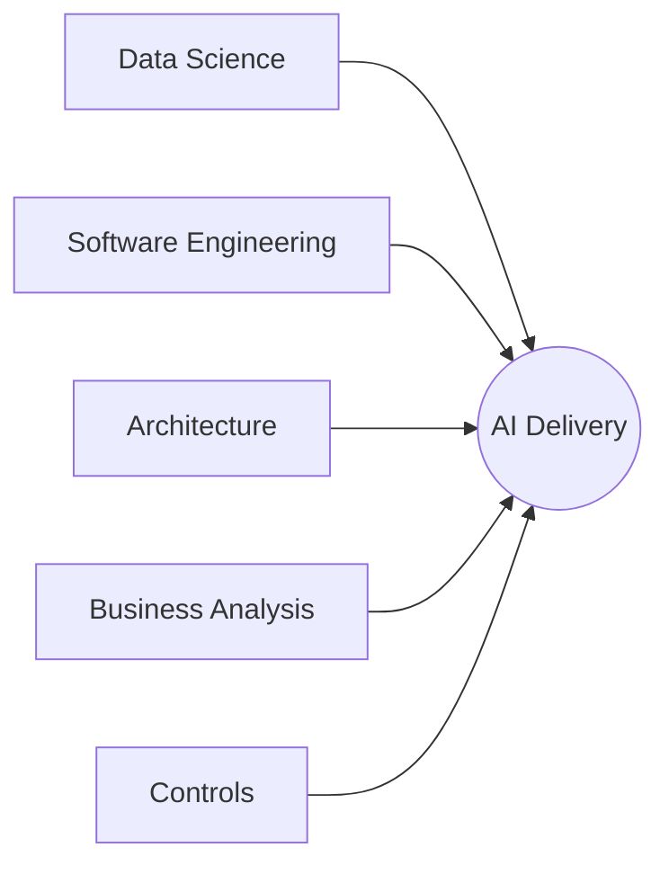

# _local-bdr-research-001: Bank Lead AI Engineer Role Definition

## Abstract

This research investigates the responsibilities, skills, and organizational positioning of a Bank Lead AI Engineer role within a financial services company (Nationale-Nederlanden) that is scaling AI initiatives across business units. The core finding is that professional AI delivery requires a connective role that glues together disciplines that otherwise operate in silos: data science, software engineering, architecture, business analysis, and controls. No existing role at NN Bank holds the combined wide and deep knowledge needed to translate between these worlds. The study concludes that a clearly chartered Bank Lead AI Engineer, reporting through the CTO organization and working as an advisory authority across teams, fills this connective gap and enables the organization to deliver AI systems that are technically sound, business-aligned, production-grade, and safely governed.

## Introduction




NN Bank is pursuing an AI-first strategy with active projects in mortgage handling agents and payment automation. Multiple business units are developing AI capabilities independently, leading to fragmented tooling choices, inconsistent engineering practices, and limited knowledge transfer between teams. The CTO organization includes architects, engineering managers, and platform teams, but no single role owns the end-to-end AI engineering lifecycle from conception through production operations. Each existing role holds a piece of the AI puzzle but lacks the cross-disciplinary depth to connect them: data scientists understand models but not production engineering, engineers understand systems but not ML workflows, architects see integration patterns but needs support with AI-specific engineering constraints, business analysts define requirements but cannot assess AI feasibility, and the controls department defines risk frameworks but lacks the technical depth to make them AI-specific. Professional AI delivery needs a glue role that speaks all these languages and connects them into a coherent whole.

The gap manifests as disconnection between these disciplines:

- **Engineering and data science disconnect**: data scientists prototype models that do not meet production engineering standards for versioning, observability, and reliability
- **No lifecycle ownership for AI in coding**: agentic tooling for code generation, architecture review, and business rule validation is adopted ad-hoc rather than governed
- **Onboarding friction**: new projects lack a go-to person who can guide teams through AI project setup, tool selection, and architectural alignment
- **Controls gap for AI**: the controls department defines risk and compliance frameworks, but lacks AI-specific expertise to create controls that are practical, proportionate, and technically sound for AI systems; without engineering input, controls risk being either too restrictive (blocking AI adoption) or too generic (missing real AI risks like hallucination, drift, and data leakage)

The company needs a connective role that glues together business requirements, architectural standards, engineering execution, and controls for AI projects. This role must be held by someone with the rare combination of deep AI/ML expertise and wide knowledge across software engineering, architecture, business, and compliance, because the glue only works when the person genuinely understands each discipline well enough to translate between them. The role also covers agentic applications across the full software lifecycle: agentic for business processes, agentic for coding, agentic for architecture review, and agentic for engineering operations.

Question: What responsibilities, skills, organizational positioning, and authority model should a Bank Lead AI Engineer role have to unify and accelerate AI adoption across a financial services organization with multiple business units and scattered AI initiatives?

## Methods

The study uses three complementary approaches to define the role:

### 1. Gap analysis from current state

Documented the current organizational structure (CEO, CTO, Architects, Engineering Managers, Business Units) and mapped where AI-related decisions are made today. Identified decision, education and standarlisation gaps:

- Business modeling for AI agents
- AI tool and framework selection
- Production-readiness standards for AI/ML systems
- Agentic system design patterns
- AI-assisted engineering lifecycle (code generation, review, testing)
- Post-deployment model monitoring and improvement cycles
- Cross-team knowledge transfer for AI projects
- AI-specific risk controls and compliance frameworks (controls department lacks AI expertise to define proportionate controls)

### 2. Responsibility domain mapping

Decomposed the AI engineering lifecycle into six responsibility domains and mapped each to the activities described in the role brief:

| Domain | Activities |
|---|---|
| **Agentic for Business** | Design and deliver agent-based solutions for business processes (mortgage, payments, customer service). Translate business requirements into agentic architectures. Work with BU stakeholders from conception to production. |
| **Agentic for Coding** | Propose, evaluate, and standardize AI-assisted coding tools. Define how code generation, completion, and refactoring agents integrate into the engineering workflow. Ensure generated code meets engineering and architecture standards. |
| **Agentic for Architecture** | Define architectural patterns for AI systems. Align with enterprise architects on integration, data flow, and platform decisions. Establish reference architectures for agent-based systems. Review architectural decisions for AI projects. |
| **Agentic for Engineering** | Define engineering standards for AI/ML systems: testing, CI/CD, observability, model versioning, reproducibility. Bridge the gap between data science prototypes and production-grade services. Own day-two concerns: monitoring, retraining pipelines, drift detection. |
| **Agentic for Governance** | Propose automated checks that enforce architecture, engineering, and business standards during development. Evaluate tools that validate compliance through AI-assisted review. Define quality gates for AI project delivery. |
| **AI Controls Advisory** | Partner with the controls department to define AI-specific risk controls that are technically sound and practically adoptable. Translate AI risks (hallucination, drift, data leakage, bias) into control language. Help create controls that enable safe AI adoption rather than block it. |

### 3. Role positioning analysis

Evaluated three organizational models for the role:

- **Model A: Embedded in a single team** - the role sits inside one team and serves others on request
- **Model B: Advisory across all teams** - the role has no direct reports but influences all AI-active teams through support, standards, and architecture collaboration
- **Model C: Dedicated AI team lead** - the role leads a standalone AI team that other teams consume as a service

Each model was assessed against criteria: speed of influence, knowledge transfer effectiveness, alignment with existing NN Bank structure, and sustainability as AI adoption grows.

### 4. Skills framework derivation

Derived required skills by cross-referencing the five responsibility domains with the organizational context. Skills were categorized into:

- **Technical depth**: AI/ML, cloud platforms, software architecture, system design
- **Technical breadth**: agentic frameworks, LLM integration, MLOps, data engineering
- **Leadership**: cross-team influence, mentoring, stakeholder communication
- **Business acumen**: understanding financial services domain, translating business needs to technical solutions

## Results

### Responsibility charter

The Bank Lead AI Engineer role owns the following responsibilities:

**Strategic alignment**
- Define the AI engineering vision and roadmap aligned with CTO and architecture direction
- Identify opportunities for AI and agentic systems across business units
- Propose and prioritize AI initiatives based on business impact and technical feasibility
- Maintain awareness of AI industry trends, tools, and research; bring relevant innovations to the organization

**Agentic for business**
- Partner with business units during project inception to translate requirements into agentic system designs
- Define patterns for agent orchestration, tool use, memory, and human-in-the-loop workflows
- Ensure business-facing agents meet compliance, auditability, and explainability requirements specific to financial services
- Guide teams through the full lifecycle: ideation, prototyping, productionization, and post-launch improvement

**Agentic for coding**
- Evaluate and recommend AI-assisted development tools (code generation, completion, review, testing)
- Define standards for how engineers use AI coding assistants (prompt guidelines, review requirements, security checks)
- Propose automated enforcement of engineering and architecture standards through AI-powered code review and linting
- Spike and prototype new agentic coding workflows; share findings with engineering teams

**Agentic for architecture and engineering**
- Collaborate with enterprise architects to define reference architectures for AI/agent systems
- Define engineering standards for AI systems: model versioning, experiment tracking, reproducibility, testing strategies
- Own the bridge between data science outputs and production engineering: packaging, serving, scaling, monitoring
- Establish day-two practices: model drift detection, retraining pipelines, performance monitoring, incident response for AI systems
- Define and maintain templates, starter kits, and documentation for teams starting new AI projects

**Agentic for governance**
- Propose tools and processes that automatically validate business rules, architecture decisions, and engineering standards in the development pipeline
- Define quality gates for AI project milestones (proof of concept, MVP, production, post-launch)
- Work with compliance and risk teams to ensure AI governance meets financial regulatory requirements

**AI controls advisory**
- Partner with the controls department to define AI-specific risk controls that are technically sound, practically adoptable, and proportionate to actual risk
- Translate AI-specific risks (hallucination, model drift, data leakage, bias, prompt injection) into control frameworks the controls department can operationalize
- Advise on what evidence and monitoring is feasible so controls are verifiable rather than aspirational
- Help the controls department distinguish between risks that need blocking controls vs. detective controls vs. advisory guidelines
- Ensure controls enable safe AI adoption rather than creating blanket restrictions that block innovation

**Advisory and knowledge transfer**
- Act as the go-to advisor for any team starting or scaling an AI project
- Conduct hands-on pairing, workshops, and architecture reviews with project teams
- Build internal communities of practice around AI engineering
- Document patterns, anti-patterns, and lessons learned as reusable organizational knowledge

### Organizational positioning analysis

| Criteria | Model A (Embedded) | Model B (Advisory) | Model C (AI Team Lead) |
|---|---|---|---|
| Speed of influence across BUs | Low - limited to host team | High - available to all teams | Medium - depends on service queue |
| Knowledge transfer to teams | Poor - siloed | Strong - direct team interaction | Medium - through service interface |
| Alignment with NN Bank structure | Poor - creates team dependency | Strong - works with existing BU/platform structure | Medium - requires new team creation |
| Accountability clarity | High - clear ownership within one team | Low - advisory has no delivery accountability | High - team owns outcomes |
| Execution speed | High - embedded, no context switching | Low - spread across many teams, advisory lag risk | High - dedicated capacity |
| Sustainability at scale | Low - single point of failure within one team | Medium - depends on champions and artifacts | High - team grows with demand |
| Hands-on capability | High - deeply embedded | Medium - selective involvement | Low - management overhead |
| Hiring feasibility | Easy - specialist profile | Hard - rare wide+deep generalist | Medium - team can cover gaps across members |

**Model B (Advisory)** scores highest on influence breadth and structural fit but has genuine weaknesses in accountability clarity, execution speed, and hiring. These weaknesses are acknowledged trade-offs, not disqualifying factors, given NN Bank's current state: only two to three BUs are actively running AI projects, and the organizational structure cannot absorb a new team (Model C) yet. As AI adoption scales, a transition toward a lightweight Model C (small complementary team led by the Bank Lead AI Engineer) should be planned.

Model C would likely become the stronger choice once three or more BUs are simultaneously running AI projects, at which point the advisory model's execution and accountability gaps become harder to compensate for.

### Skills profile

**Required technical skills**
- 5+ years in AI/ML engineering with production deployment experience
- Strong background in software engineering, cloud platforms (AWS/Azure/GCP), and distributed systems
- Experience with agentic AI frameworks (LangChain, CrewAI, AutoGen, or similar)
- Knowledge of MLOps practices: model serving, experiment tracking, CI/CD for ML, monitoring
- System design and architecture experience for large-scale applications
- Understanding of LLM integration patterns: RAG, fine-tuning, prompt engineering, evaluation

**Required leadership skills**
- Cross-functional collaboration without direct authority
- Technical mentoring and knowledge transfer
- Stakeholder communication at both engineering and business levels
- Ability to balance strategic thinking with hands-on execution
- Experience working in regulated industries (financial services preferred)

**Required business skills**
- Translating business requirements into technical AI solutions
- Understanding of financial services domain (banking, insurance, mortgages, payments)
- Cost-benefit analysis for AI investments
- Risk awareness for AI in regulated environments

### Day-two ownership model

```
+-------------------+     +-------------------+     +-------------------+
|   Conception      |     |   Delivery        |     |   Operations      |
|                   |     |                   |     |                   |
| Business need     |     | Implementation    |     | Monitoring        |
| Feasibility       |---->| Engineering       |---->| Model versioning  |
| Architecture      |     | Testing           |     | Drift detection   |
| Team enablement   |     | Quality gates     |     | Retraining        |
|                   |     |                   |     | Improvement cycle  |
+-------------------+     +-------------------+     +-------------------+
        ^                                                    |
        |                                                    |
        +-------- Feedback & lessons learned ----------------+

Bank Lead AI Engineer: advisory presence across all three phases
```

## Discussion

The Bank Lead AI Engineer role is fundamentally a glue role. Its value comes not from owning any single domain but from being the person who can sit in a room with data scientists, software engineers, architects, business analysts, and controls officers and translate between all of them. Each of these disciplines makes AI decisions through their own lens: a data scientist optimizes for model accuracy, an engineer for system reliability, an architect for integration coherence, a business analyst for requirement coverage, and a controls officer for risk mitigation. Without someone who deeply understands all these perspectives, each domain optimizes locally while the overall AI initiative suffers from misalignment.

This glue function requires a rare profile: deep expertise in AI/ML (not just surface knowledge) combined with wide, practical experience in software engineering, cloud platforms, system architecture, and business analysis. The role cannot be filled by a pure data scientist who lacks engineering fundamentals, nor by a pure engineer who lacks AI depth, nor by a pure architect who has never shipped an ML model. The breadth and depth together are what make the connective function possible.

The role is deliberately broad in scope but narrow in authority model. It operates through influence, standards, and direct enablement rather than command-and-control. This is critical for NN Bank's context where business units have their own resources and stakes, and the role must earn trust through demonstrated value rather than organizational mandate.

The addition of controls advisory as a distinct responsibility recognizes that financial services controls departments often lack the technical depth to create AI-specific controls on their own. Without engineering input, controls tend to be either overly restrictive (blocking AI adoption entirely) or overly generic (copy-pasting data governance controls that miss AI-specific risks like hallucination, drift, and prompt injection). The Bank Lead AI Engineer bridges this gap by translating technical AI risks into control language and helping the controls department design frameworks that are both practically adoptable and genuinely protective.

The six-domain decomposition (business, coding, architecture, engineering, governance, controls) reflects the reality that agentic AI is not confined to business automation. The most mature organizations treat AI as a cross-cutting capability that transforms how code is written, how architectures are validated, how standards are enforced, and how business rules are checked, not just how customer-facing processes are automated. Without a central advisory function, teams independently adopt different agent frameworks, prompt patterns, and evaluation methods, making cross-team learning and standardization difficult. By explicitly chartering the role across all six domains, the organization avoids the common trap of hiring an "AI person" who only works on business-facing models while engineering tooling and practices remain unaddressed.

The advisory model (Model B) carries a known risk: without formal authority, the role's effectiveness depends entirely on the individual's credibility and the organization's willingness to follow guidance. Mitigations include:

- CTO-level sponsorship that gives the role a clear mandate
- Defined quality gates that require Bank Lead AI Engineer sign-off for AI projects
- Regular architecture review participation where AI decisions are discussed
- Published standards and reference architectures that create gravitational pull

### Key risks and mitigations

| Risk | Impact | Mitigation |
|---|---|---|
| **Influence without teeth** - advisory authority is ignored when teams are under delivery pressure | Standards are bypassed, quality gates skipped, AI systems go to production without proper engineering | Formalize quality gate sign-off as a mandatory step in the delivery process, not an optional consultation. CTO backs escalation when teams bypass gates. Make the first few engagements deliver visible wins so the role earns trust early. |
| **Single point of failure** - all cross-disciplinary AI knowledge concentrates in one person | If the person leaves, the organization loses the connective tissue with no fallback | From day one, the role must codify knowledge into reusable artifacts: reference architectures, decision records, starter kits, recorded workshops. Identify and develop an AI champion in each active team who can carry local context. This also mitigates the overload risk. |
| **Scope overload** - six domains across all business units is too large a surface for one person | Role spreads too thin, becomes superficial everywhere, and loses the depth that makes the glue function credible | Prioritize ruthlessly. Focus on the two or three business units with active AI projects. Defer domains where existing roles (e.g., architects for architecture, compliance for controls) are already functional. Expand scope gradually as standards and champions reduce the per-team effort. |
| **Territory friction** - architects, data scientists, or controls officers see the role as overstepping into their domain | Passive resistance, exclusion from decisions, or political friction that undermines effectiveness | Position the role explicitly as enabling, not replacing. The Bank Lead AI Engineer does not own architecture (architects do), does not own controls (controls department does), and does not own data science (data scientists do). The role translates between them. Early joint wins with each group establish the collaborative dynamic. |
| **False sense of coverage** - organization assumes "we have an AI person" and underinvests in building AI capabilities within teams | Teams become dependent on the role instead of growing their own AI skills, creating a bottleneck | Measure success by team self-sufficiency, not by how many teams need the Bank Lead AI Engineer. Explicit goal: every team the role engages with should need less support over time, not more. |
| **Advisory lag** - by the time the role is consulted on a project, key technical decisions are already locked in | Role is reduced to reviewing decisions already made, losing the ability to shape direction | Embed the role early in the project lifecycle. Mandatory involvement at project inception (before technology choices are made), not just at quality gates. Architecture review board participation ensures visibility into upcoming decisions. |

The day-two ownership emphasis deserves attention. Financial services AI systems carry regulatory and reputational risk that makes this non-negotiable. The role must ensure that every AI system deployed has a monitoring strategy, a retraining path, and a degradation plan before it reaches production.

One limitation of this study is that it is based on a single organizational context. The specific responsibilities and positioning may need adjustment for organizations with different structures, AI maturity levels, or regulatory environments.

The hands-on component is intentionally kept as "when necessary" rather than primary. A principal-level role that spends most time coding reduces their multiplier effect. The highest leverage comes from enabling ten teams to build well rather than building one thing perfectly.

### Enabling structures

The advisory model places a heavy workload on a single person across six domains and all business units. The following structures multiply the role's impact and directly address the risks identified above.

**AI Champions Network.** Designate one AI-interested engineer per active team as a local champion. The Bank Lead AI Engineer trains, aligns, and supports champions; champions handle day-to-day AI guidance within their team. This distributes knowledge (mitigating single point of failure), reduces per-team engagement effort (mitigating scope overload), and builds the succession pipeline. Champions also become the local advocates for standards adoption, reducing the risk of shelfware.

**Tiered engagement model.** Not all teams need the same support level:

| Tier | When | Cadence |
|---|---|---|
| **Deep** | Teams starting new AI projects (inception through first production release) | Hands-on pairing, architecture reviews, weekly |
| **Light** | Teams with running AI systems | Periodic check-ins, standard compliance, ad-hoc |
| **Self-service** | Teams using published standards, templates, and starter kits | No active engagement |

This prevents the role from being spread equally thin everywhere and makes the workload predictable.

**Formal architecture integration.** A permanent seat on the architecture review board and standing slots with platform teams. This gives the role early visibility into decisions (mitigating advisory lag) and legitimizes the advisory authority without needing separate enforcement mechanisms.

**Virtual AI Practice Group.** A cross-team forum (not a new org unit) that meets regularly: the Bank Lead AI Engineer, champions, data scientists, and interested engineers. Functions as a knowledge-sharing and standard-socialization mechanism. Lower effort than individual team engagements with broader reach.

**Knowledge infrastructure.** Invest early in reusable artifacts that reduce per-engagement effort: reference architectures, decision records, starter kits, recorded workshops, evaluation templates. Every engagement should produce an artifact that makes the next similar engagement cheaper. This is the primary mechanism for scaling the role's influence beyond direct interaction.

**CTO-backed operating rhythm.** A defined cadence that protects the role from becoming purely reactive:

- Monthly AI strategy sync with CTO
- Bi-weekly architecture board participation
- Quarterly AI maturity review across BUs
- Dedicated research/spike time (e.g., 20%) for innovation scouting

The operating rhythm ensures strategic work does not get displaced by operational support requests.

**Growth path: small complementary team.** As AI adoption scales beyond three active BUs, one person cannot sustain the advisory load. Plan for growth to two or three people with complementary profiles (one leaning ML/data science depth, one platform/engineering, one business/governance). The Bank Lead AI Engineer leads this small group. This is a gradual evolution from Model B (advisory) toward a lightweight version of Model C (small team) without the bottleneck risk, because the champions network still carries local execution.

The recommended starting combination for NN Bank's current state is **champions network + tiered engagement + architecture board seat + knowledge infrastructure**. The small team is a growth path for when three or more BUs are simultaneously running AI projects.

## Conclusion

The Bank Lead AI Engineer role at NN Bank should be an advisory position working across all business units and platform teams, reporting through the CTO organization. Its six responsibility domains (agentic for business, coding, architecture, engineering, governance, and AI controls advisory) cover the full AI lifecycle from business conception through production operations and day-two sustainability, including the creation of healthy AI-specific controls that enable safe adoption.

The role requires a rare combination of deep AI/ML expertise, strong software engineering fundamentals, architectural thinking, and cross-functional leadership. This combination is not optional; the glue function only works when the person genuinely understands each discipline well enough to earn credibility with specialists and translate between their concerns. The advisory positioning (Model B) best fits NN Bank's existing organizational structure and allows the role to scale influence through standards, enablement, and direct team support without requiring organizational restructuring.

Key success factors include CTO-level sponsorship, defined quality gates for AI projects, and a clear mandate to define standards that apply across business units. The role should be measured by organizational AI capability growth, not just individual project delivery.

Open questions for the subsequent BDR:
- Formal reporting line and escalation path
- Budget authority for tool and platform decisions
- Interaction model with external AI vendors and consultancies
- Career progression path for the role

## References

- [Presentation slides](.assets/001-principal-ai-engineer-role-slides.md) - Executive overview of the role
- [_local-bdr-001](../../principles/001-agentme-product-purpose.md) - Product context for the agentme project
- [_core-adr-001](../../../../_core/adrs/principles/001-xdrs-core.md) - XDR framework for organizational decision structure
- [Nationale-Nederlanden organizational context] - Internal company structure as described by stakeholder input
- [Google - People + AI Research](https://pair.withgoogle.com/) - Reference for human-AI interaction patterns
- [Microsoft - AI Engineering practices](https://learn.microsoft.com/en-us/azure/architecture/ai-ml/) - Industry reference for AI engineering at scale
- [MLOps Community - ML Engineering Role Definitions](https://mlops.community/) - Industry benchmarks for ML/AI engineering roles
