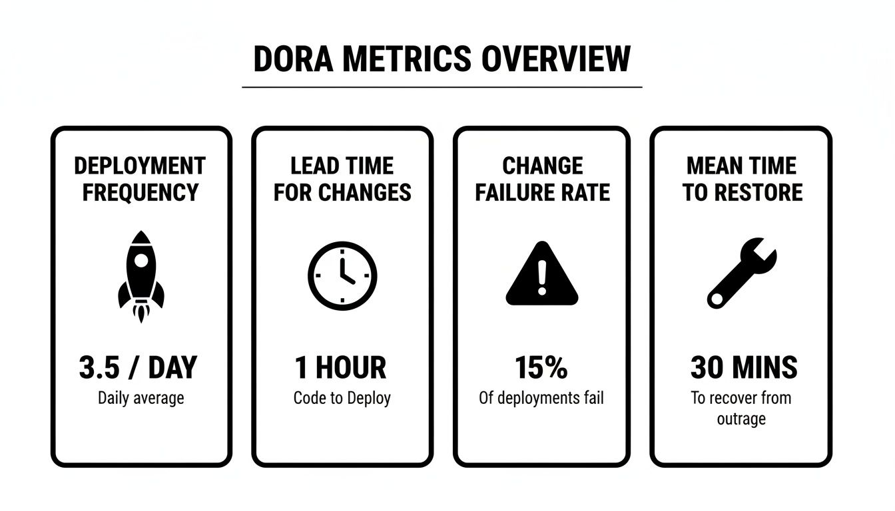
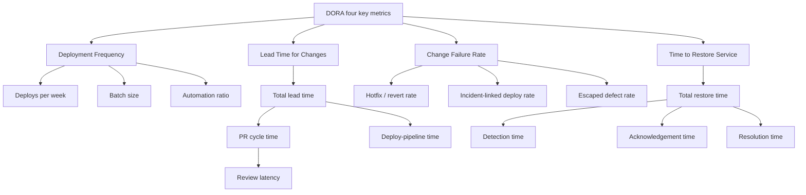
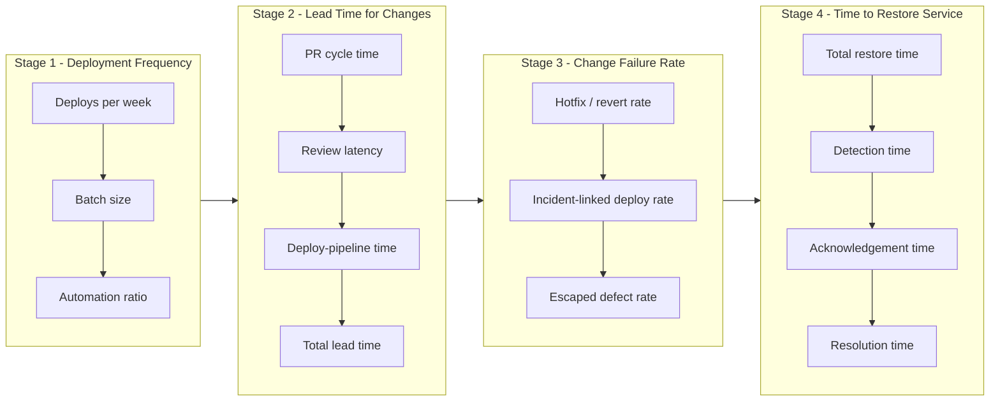
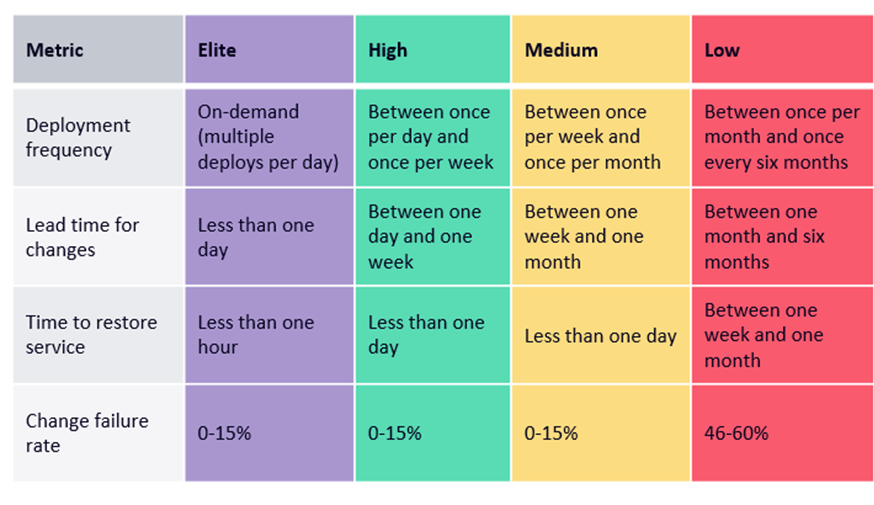

# _local-edr-article-001: Understanding and Adopting DORA Metrics

## Overview

Explains DORA's four key delivery metrics — what each measures, how each decomposes into incrementally-adoptable sub-metrics, and a suggested adoption order from simplest to most complex. For engineers already using git, PR review, CI/CD, and production monitoring.

## Content

### The four keys, at a glance

*Illustrative example values — actual numbers vary per team and service; see the per-metric sections below for how each is really calculated.*

DORA's four key metrics measure software delivery performance from two angles: throughput (how fast and how often you ship) and stability (how often a change hurts users and how fast you recover). [agentme-edr-402](../../../../agentme/edrs/operations/402-dora-metrics-framework.md) requires every metric to be measured per deployable service and rolled up per team, never blended into a single org-wide number, and assigns each team a named maturity tier (Elite/High/Medium/Low) per metric plus one blended tier equal to the worst of the four.

Each metric also decomposes into sub-metrics, but not in the same way. Lead Time for Changes and Time to Restore Service are **additive**: their sub-metrics sum to the parent value, so you can see exactly where time goes. Deployment Frequency and Change Failure Rate are **complementary**: their sub-metrics are independent detection signals that must never be summed into one figure. The map below shows all four decompositions together:

*Branches under Lead Time and Time to Restore sum to their parent; branches under Deployment Frequency and Change Failure Rate are independent signals, read side by side instead of added up.*

### Deployment Frequency: how often you ship

Deployment Frequency counts successful deploy-workflow runs to a service's default or release branch. [agentme-edr-403](../../../../agentme/edrs/operations/403-dora-deployment-frequency.md) decomposes it into three non-summing signals: **deploys per week** (successful runs per week, attributed via CODEOWNERS), **batch size** (PRs merged between two consecutive deploys — a leading indicator for both lead time and failure risk), and **automation ratio** (automated runs over all runs, keeping mandatory approval gates out of the "manual" count). It is the cheapest metric to start with, since it needs only deploy-workflow history as a data source.

### Lead Time for Changes: how fast a commit reaches production

Lead Time for Changes measures how long a change takes from first commit to running in production. [agentme-edr-404](../../../../agentme/edrs/operations/404-dora-lead-time-for-changes.md) breaks the total into additive phases: **PR cycle time** (first commit to merge), containing **review latency** as a drill-down (PR open to first review — worth reading jointly with Change Failure Rate, since an unusually fast review latency can just mean rubber-stamping), plus **deploy-pipeline time** (merge to deploy, including any manual approval gate). PR cycle time plus deploy-pipeline time equals total lead time, always reported as a median to resist outlier skew.

### Change Failure Rate: how often a change hurts users

Change Failure Rate captures failure through three independent detection signals rather than one. [agentme-edr-405](../../../../agentme/edrs/operations/405-dora-change-failure-rate.md) defines **hotfix/revert rate** (reverts shortly after a deploy over total deploys — the most severe, most obvious failures), **incident-linked deploy rate** (deploys referenced by an `incident`-labeled issue), and **escaped defect rate** (post-release `bug`+`production`-labeled issues over total deploys — the slowest-to-surface failures). None of the three are summed; a team may lean on one as it matures, but all three stay visible. An incident whose root cause traces to another team's change counts against that team's rate, not the impacted team's.

### Time to Restore Service: how fast you recover

Time to Restore Service (DORA's current term is Failed Deployment Recovery Time) measures recovery after a failed deployment. [agentme-edr-406](../../../../agentme/edrs/operations/406-dora-time-to-restore-service.md) tracks **total restore time** (incident opened to closed) standalone, then decomposes it additively into **detection time** (failure to detected), **acknowledgement time** (detected to acknowledged), and **resolution time** (acknowledged to actually fixed, not merely issue-closed) — the three phases sum back to the total.

### Adopting the metrics: simplest to most complex

[agentme-edr-402](../../../../agentme/edrs/operations/402-dora-metrics-framework.md) orders adoption as Deployment Frequency, then Lead Time for Changes, then Change Failure Rate, then Time to Restore Service — each stage needs one more data source than the last (deploy-workflow history only; then PR data; then a failure-labeling convention; then incident-management timestamps), and improving batch size and frequency first tends to cascade into better lead time and stability. Each policy also orders its own sub-metrics the same way: cheapest data source first, most cross-correlated — and most valuable — last. The full roadmap:

Start a service at Stage 1 even if it never moves further: deploys-per-week alone is already a useful throughput signal. Treat each stage as a prerequisite budget check, not a gate — a team can pilot Lead Time on one service while still rolling out automation ratio on another. Whatever tier a service lands on, [agentme-edr-402](../../../../agentme/edrs/operations/402-dora-metrics-framework.md) reports it as part of a company-wide tier distribution, never averaged into one number and never used to rank teams against each other.

*DORA's published tier bands, referenced by [agentme-edr-402](../../../../agentme/edrs/operations/402-dora-metrics-framework.md)'s `05-maturity-level-definition` — check the DORA source below for the current, dated version before quoting a band as current.*

## References

- [agentme-edr-402](../../../../agentme/edrs/operations/402-dora-metrics-framework.md) - DORA metrics framework: per-service accounting, maturity tiers, and adoption order
- [agentme-edr-403](../../../../agentme/edrs/operations/403-dora-deployment-frequency.md) - Deployment Frequency calculation and sub-metrics
- [agentme-edr-404](../../../../agentme/edrs/operations/404-dora-lead-time-for-changes.md) - Lead Time for Changes calculation and sub-metrics
- [agentme-edr-405](../../../../agentme/edrs/operations/405-dora-change-failure-rate.md) - Change Failure Rate calculation and sub-metrics
- [agentme-edr-406](../../../../agentme/edrs/operations/406-dora-time-to-restore-service.md) - Time to Restore Service calculation and sub-metrics
- [DORA's software delivery performance metrics](https://dora.dev/guides/dora-metrics-four-keys/) - Original external source for the four keys
