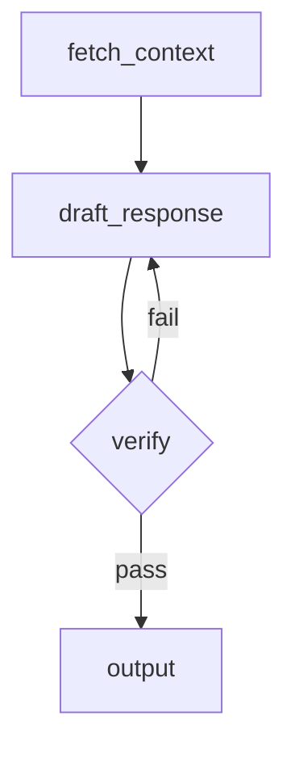

# agentme-edr-policy-018: AI agent development standards

## Context and Problem Statement

AI agent projects vary widely in how they choose frameworks, manage context, evaluate outputs, and expose policies to the agent at runtime. Without a shared baseline, projects accumulate incompatible patterns for LLM provider abstraction, flow design, dataset-driven testing, and knowledge delivery.

Which tools, frameworks, and design patterns should AI agent projects follow to ensure reproducibility, testability, and maintainability?

## Decision Outcome

**Use Python with LangGraph for flow orchestration, MLflow for experiment tracking and local evaluation, and a file-system-based XDRS knowledge layer that the agent queries at runtime via explicit file tools.**

### Details

#### 01-language-and-framework

All agent projects MUST be implemented in Python, following [agentme-edr-014](014-python-project-tooling.md) for project structure, tooling, and Makefile conventions.

Agent flows MUST be built with **LangGraph**. Use LangGraph `StateGraph` to model each distinct workflow as an explicit directed graph with typed state.

#### 02-llm-provider-compatibility

Agent code MUST be compatible with both **OpenAI** and **Azure OpenAI** providers without code changes. Achieve this by:

- Using the `langchain-openai` package which supports both providers through environment variables.
- Selecting the provider by setting `OPENAI_API_TYPE=azure` (Azure OpenAI) or omitting it (OpenAI).
- Never hardcoding provider-specific URLs, deployment names, or API versions in code; inject them through environment variables or a configuration object.

Minimum required environment variable surface:

| Variable | Purpose |
|---|---|
| `OPENAI_API_KEY` | API key (both providers) |
| `OPENAI_API_BASE` / `AZURE_OPENAI_ENDPOINT` | Endpoint (Azure only) |
| `OPENAI_API_VERSION` | API version (Azure only) |
| `AZURE_OPENAI_DEPLOYMENT` | Deployment/model name (Azure only) |
| `OPENAI_MODEL` | Model name (OpenAI only) |

#### 03-observability-and-experiment-tracking

Use **MLflow** for all agent observability and evaluation:

- Wrap each agent run with `mlflow.start_run()` to capture traces, parameters, and metrics locally.
- Enable LangChain auto-tracing via `mlflow.langchain.autolog()` at entry point startup.
- Log run parameters (model name, temperature, prompt version) and output metrics (accuracy, latency, token counts) using `mlflow.log_param` / `mlflow.log_metric`.
- Run a local MLflow tracking server with `mlflow ui` to inspect runs during development. Do not require a remote MLflow server for local development.

#### 04-dataset-driven-accuracy-measurement

Every agent pipeline MUST have a companion evaluation dataset and an MLflow experiment that measures accuracy against it. Datasets and evals are organized per-workflow following rule `09-workflow-structure` and rule `10-workflow-evals`.

- Store evaluation datasets under `evals/<workflow>/` (sibling of `lib/` and `examples/`), following [agentme-edr-019](019-ml-dataset-structure.md) for structure and format. For MLflow input/output pairs, use the JSONL format described in `agentme-edr-019.04-complex-structured-datasets-must-use-jsonl`.
- Write evaluation scripts under `evals/<workflow>/` that load the dataset, run each input through the live agent (against real LLMs, not mocks), compare outputs to expected values, and log per-sample and aggregate metrics to an MLflow experiment.
- Add a `make eval` Makefile target in the module root Makefile (the same Makefile that sits alongside `lib/` and `examples/`) that delegates to all per-workflow eval targets.
- Evaluation MUST run against real LLM providers, not recorded responses, to capture model drift. MLflow tracking MUST work locally without a remote server.

#### 05-flow-documentation

Each agent flow MUST be documented as a **Mermaid graph** in the project `README.md`. The diagram must match the LangGraph `StateGraph` definition:

- Use `graph TD` or `graph LR` direction.
- Label each node with its Python function name.
- Label conditional edges with the condition expression.
- Update the diagram whenever the graph topology changes.

Example minimal diagram block:



#### 06-xdrs-knowledge-layer

When an agent must follow elaborate procedures, decision frameworks, or domain rules:

**Static files distributed with the library**

- All static files accessed by agents at runtime (XDRS documents, reference tables, domain dictionaries, lookup files) MUST live under a `data/` folder inside the library source tree (`lib/data/`) and be embedded in the package data manifest (e.g. `pyproject.toml` `[tool.hatch.build] include` or equivalent).
- XDRS Policy and Skill documents MUST be placed at `lib/data/.xdrs/`, using the standard XDRS scope/type/subject folder structure (following `_core-adr-policy-001`).
- Other static context data (reference tables, domain dictionaries, structured lookup files) MUST be placed under `lib/data/` in an appropriate sub-folder (e.g. `lib/data/context/`).
- The agent system prompt MUST NOT inline procedure text. It MUST instruct the agent to read specific paths and follow the instructions found there. Example:

  ```
  Before answering, read and follow the instructions in data/.xdrs/_local/edrs/procedures/triage.md.
  ```

**Dynamic context generated per workflow instantiation**

- Context files that are generated at runtime per workflow run (unpacked archives, fetched documents, intermediate outputs) MUST be written to a temporary directory created via the OS temp API (`tempfile.mkdtemp()` in Python).
- The temporary directory MUST be created at the start of the workflow run and passed into the workflow state so all nodes share the same path.
- The temporary directory MUST be deleted (including all contents) when the workflow run finishes, whether it succeeds or fails, using a `try/finally` block or a context manager.
- The agent file tools MUST be configured with the temporary directory path at workflow startup so the agent can read from it during the run.

- The agent file tools MUST expose `data/` (for static files) and the temporary directory (for dynamic files) as sandboxed readable roots (see rule `07-agent-file-tools`).

#### 07-agent-file-tools

Every agent that uses the XDRS knowledge layer or file-based context MUST be equipped with at least the following tools:

| Tool | Purpose |
|---|---|
| `read_file(path)` | Read the full content of a file by path |
| `search_files(directory, pattern)` | Glob-search for files matching a pattern under a directory |
| `grep_file(path, query)` | Search for lines matching a string or regex within a file |

Implement these tools as LangChain `@tool`-decorated functions with explicit path sandboxing. Two sandboxed roots MUST be configured:

| Root | Content | Source |
|---|---|---|
| `DATA_ROOT` | Static files shipped with the library (`lib/data/`) | Package data; resolved via `importlib.resources` or a path relative to the installed package |
| `TEMP_ROOT` | Dynamic files generated for the current workflow run | Temporary directory created by `tempfile.mkdtemp()` at workflow startup |

Resolve all paths against the appropriate root. Reject any path that would escape its root (no `../` traversal). `TEMP_ROOT` MUST be passed into the tool factory at workflow startup, not read from a global variable.

#### 08-verification-steps

Agent flows MUST include at least one explicit verification node before producing final output:

- Model the verification step as a dedicated LangGraph node (e.g. `verify_output`).
- The node checks the draft output against defined acceptance criteria (schema validation, factual consistency check, rubric scoring, or LLM-as-judge call).
- On failure, the verification node MUST route back to the relevant generation node, not silently pass through.
- Log verification results (pass/fail, score, reason) as MLflow metrics on the current run.

#### 09-workflow-structure

Agent logic MUST be organized as named workflows. Each workflow is an independent LangGraph `StateGraph` with a defined start node and end node, connecting agents, states, routes, and decision nodes.

For each workflow named `<workflow>`, create:

```text
lib/
  workflows/
    <workflow>/
      graph.py        # StateGraph definition; entry point for the workflow
      agents.py       # LangChain agent definitions used by this workflow
      states.py       # Typed state dataclasses / TypedDicts
      routes.py       # Conditional edge functions
```

- `graph.py` MUST define and compile the `StateGraph` and expose a `graph` object that callers invoke.
- Additional modules (tools, prompts, schemas) MAY be added inside `lib/workflows/<workflow>/` when they are specific to that workflow. Shared utilities belong in `lib/<module>/`.
- Each workflow MUST be documented with a Mermaid diagram in the project `README.md` following rule `05-flow-documentation`.

#### 10-workflow-evals

For each workflow `<workflow>` there MUST be a corresponding eval directory:

```text
evals/
  <workflow>/
    Makefile                   # eval targets for this workflow
    dataset_<slice>/           # one folder per eval slice (see agentme-edr-019)
    eval_<slice>.py            # evaluation script for each slice
```

The `evals/<workflow>/Makefile` MUST define:

| Target | Behaviour |
|---|---|
| `test-eval` | Runs all eval slices for the workflow |
| `test-eval-<slice>` | Runs one named slice (e.g. `test-eval-simple`, `test-eval-complex`) |

Each `eval_<slice>.py` script MUST:

- Load the dataset from `evals/<workflow>/dataset_<slice>/` following [agentme-edr-019](019-ml-dataset-structure.md).
- Run every input through the live workflow against real LLMs.
- Log per-sample and aggregate metrics to an MLflow experiment that runs locally.

The module root Makefile `make eval` target MUST delegate to `test-eval` in every `evals/<workflow>/Makefile`.

