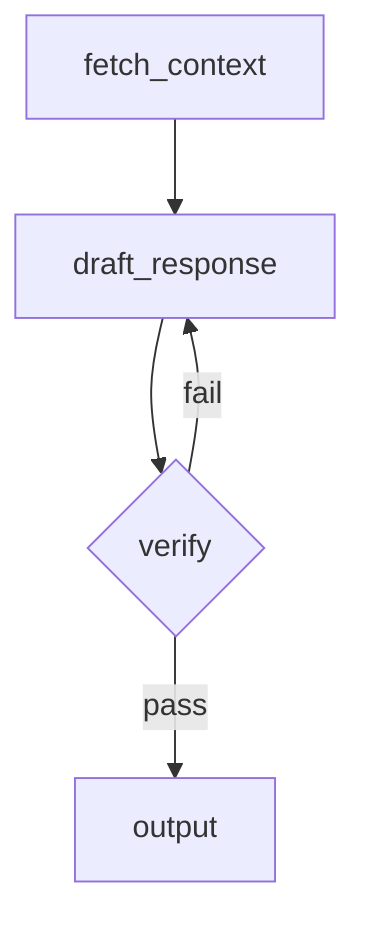

# agentme-edr-policy-021: AI workflow development standards

## Context and Problem Statement

AI workflow projects vary widely in how they structure directed graphs, manage state, evaluate outputs, and test execution paths. Without a shared baseline, projects accumulate incompatible patterns for flow design, state management, and dataset-driven testing.

Which tools, frameworks, and design patterns should AI workflow projects follow to ensure reproducibility, testability, and maintainability?

## Decision Outcome

**Use Python with LangGraph for flow orchestration and MLflow for experiment tracking and local evaluation.**

### Details

#### 01-language-and-framework

Workflows MUST be built with **LangGraph**. Use LangGraph `StateGraph` to model each distinct workflow as an explicit directed graph with typed state.

For all direct LLM calls within workflow nodes, use LangChain per [agentme-edr-018](018-ai-llm-development-standards.md). For agent nodes with tool-invocation loops, use deepagents per [agentme-edr-019](019-ai-agents-development-standards.md).

#### 03-observability-and-experiment-tracking

Use **MLflow** for all workflow observability and evaluation:

- **Workflow-level tracking:** Wrap each workflow run with `mlflow.start_run()` to capture traces, parameters, and metrics locally.
- **LLM-level auto-tracing:** Enable LangChain auto-tracing per [agentme-edr-018](018-ai-llm-development-standards.md) rule `03-llm-observability` by calling `mlflow.langchain.autolog()` during application startup. This captures inputs, outputs, token counts, and latency for every LangChain call within workflow nodes.
- Log run parameters (model name, temperature, prompt version) and output metrics (accuracy, latency, token counts) using `mlflow.log_param` / `mlflow.log_metric`.
- Run a local MLflow tracking server with `mlflow ui` to inspect runs during development. Do not require a remote MLflow server for local development.
- The project Makefile MUST expose a `dev-mlflow` target to start the local MLflow tracking server, per [agentme-edr-008](../devops/008-common-targets.md) rule `09-ai-project-dev-targets`.

#### 04-dataset-driven-accuracy-measurement

Projects MUST follow the eval dataset and implementation requirements defined in [agentme-edr-028](028-ai-eval-standards.md). Testing requirements (when evals are required, release gates) are defined in [agentme-edr-007](../principles/007-project-quality-standards.md) rule `09-ai-project-testing-requirements`.

#### 05-flow-documentation

Each workflow MUST be documented as a **Mermaid graph** in a `README.md`. The diagram MUST match the LangGraph `StateGraph` definition:

- Use `graph TD` or `graph LR` direction.
- Label each node with its Python function name.
- Label conditional edges with the condition expression.
- Update the diagram whenever the graph topology changes.

Example minimal diagram block:



#### 06-verification-steps

Workflows MUST include at least one explicit verification node before producing final output:

- Model the verification step as a dedicated LangGraph node (e.g. `verify_output`).
- The node checks the draft output against defined acceptance criteria (schema validation, factual consistency check, rubric scoring, or LLM-as-judge call).
- On failure, the verification node MUST route back to the relevant generation node, not silently pass through.
- Log verification results (pass/fail, score, reason) as MLflow metrics on the current run.

#### 07-workflow-structure

Workflow logic MUST be organized as named workflows following [agentme-edr-026](026-pragmatic-hexagonal-architecture.md). Each workflow is an independent LangGraph `StateGraph` with a defined start node and end node, connecting LLM nodes, agent nodes, algorithmic nodes, states, routes, and decision nodes.

Workflows live inside `app/workflows/` (the application layer), while external integrations such as LLM providers, vector stores, and third-party APIs live under `adapters/connectors/` (the outbound adapter layer). Inbound interfaces (HTTP API, CLI) live under `adapters/` as inbound adapters.

For each workflow named `<workflow>`, the full project layout is:

```text
lib/src/<package_name>/
  adapters/
    http/                      # inbound: API server that triggers workflows
    cli/                       # inbound: CLI entry point (if applicable)
    connectors/                # outbound: external resource integrations
      openai/                  # LLM provider connector
      azure-openai/            # alternative LLM provider connector
      postgres/                # database connector (if applicable)
      vector-store/            # vector DB connector (if applicable)
  app/
    workflows/
      <workflow>/
        graph.py               # StateGraph definition; entry point for the workflow
        agents.py              # deepagents agent definitions used by this workflow
        states.py              # Typed state dataclasses / TypedDicts
        routes.py              # Conditional edge functions
  shared/                      # infrastructure-agnostic utilities
```

- `app/workflows/<workflow>/graph.py` MUST define and compile the `StateGraph` and expose a `graph` object that callers invoke.
- Tool calls within workflow nodes that interact with external systems MUST use connectors from `adapters/connectors/`, not inline API calls.
- Additional modules (prompts, schemas) MAY be added inside `app/workflows/<workflow>/` when they are specific to that workflow. Shared utilities belong in `shared/`.

#### 08-workflow-evals

Projects MUST follow the eval folder structure and script requirements defined in [agentme-edr-028](028-ai-eval-standards.md).

#### 09-node-naming-conventions

Nodes MUST follow the naming conventions defined in [agentme-edr-029](029-ai-workflow-naming-conventions.md) rule `01-node-naming-conventions`.

#### 10-workflow-unit-testing

All LLM calls within workflow nodes are external API calls and MUST be mocked in unit tests per [agentme-edr-018](018-ai-llm-development-standards.md) rule `04-unit-test-mocking`. Workflow unit tests must run fully offline with no real LLM provider calls.

Choose the mock utility based on what the node under test expects from the model:

- Use **`FakeListChatModel`** when nodes only read `AIMessage.content` (e.g. a routing node that checks a text label).
- Use **`GenericFakeChatModel`** when any node in the workflow expects tool calls, structured outputs, or when the workflow contains `_agent` nodes that drive a tool-invocation loop.

**Example — workflow with plain-text LLM nodes:**

```python
from langchain_core.language_models.fake_chat_models import FakeListChatModel

def test_document_workflow_approve_path():
    # Responses consumed in node execution order
    fake_model = FakeListChatModel(responses=["APPROVE", "Meets all criteria."])

    workflow = DocumentWorkflow(model=fake_model)
    result = workflow.run(input_doc)

    assert result.status == "approved"
```

**Example — workflow containing an agent node (`_agent` suffix):**

```python
from langchain_core.language_models.fake_chat_models import GenericFakeChatModel
from langchain_core.messages import AIMessage

def test_document_workflow_with_agent_node():
    tool_call_msg = AIMessage(
        content="",
        tool_calls=[{"name": "fetch_context", "args": {"doc_id": "42"}, "id": "c1"}]
    )
    agent_final_msg = AIMessage(content="Context retrieved successfully.")
    routing_msg = AIMessage(content="APPROVE")

    fake_model = GenericFakeChatModel(
        messages=iter([tool_call_msg, agent_final_msg, routing_msg])
    )

    workflow = DocumentWorkflow(model=fake_model)
    result = workflow.run(input_doc)

    assert result.status == "approved"
```

Workflows MUST accept the LLM instance as a constructor parameter so that unit tests can inject a fake. See the injectable LLM pattern in [agentme-edr-018](018-ai-llm-development-standards.md) rule `04-unit-test-mocking`.

#### 11-state-type-conventions

State types MUST follow the conventions defined in [agentme-edr-029](029-ai-workflow-naming-conventions.md) rule `02-state-type-conventions`.

#### 12-workflow-naming-conventions

Workflows MUST be named following the conventions in [agentme-edr-029](029-ai-workflow-naming-conventions.md) rule `04-workflow-naming-conventions`.

#### 13-judge-node-output-format

Judge nodes MUST use the output format defined in [agentme-edr-029](029-ai-workflow-naming-conventions.md) rule `03-judge-node-output-format`.

#### 15-workflow-state-persistence

For long-running workflows that may need to be paused and resumed:

- Use LangGraph's built-in checkpointing with `MemorySaver` for development and testing.
- Use persistent checkpointers (e.g., `PostgresSaver`, or Redis-based checkpointers) for production workflows that need durability.
- Checkpoint state MUST be serializable (use TypedDict or dataclasses with JSON-compatible fields).
- Document the checkpoint strategy in the workflow's README.md.

**Example with MemorySaver (development):**

```python
from langgraph.checkpoint.memory import MemorySaver

checkpointer = MemorySaver()
graph = workflow.compile(checkpointer=checkpointer)

# Resume from checkpoint
result = graph.invoke(input_state, config={"thread_id": "session-123"})
```

**When to use checkpointing:**

- Workflows that take > 30 seconds to complete
- Workflows that require human-in-the-loop approval or input
- Workflows that are non-indempotent
- Workflows that may fail mid-execution and need to be retried from the last successful node
- Multi-session workflows where state persists across user interactions

#### 16-cross-element-naming-coherence

All workflow elements MUST maintain naming coherence as defined in [agentme-edr-029](029-ai-workflow-naming-conventions.md) rule `05-cross-element-naming-coherence`.

## References

- [agentme-edr-029](029-ai-workflow-naming-conventions.md) — AI workflow naming conventions: node suffixes/prefixes, state types, judge output schema, workflow names, and cross-element coherence
- [agentme-edr-018](018-ai-llm-development-standards.md) — LLM development standards: LangChain framework, provider configuration, LLM observability, and unit test mocking
- [agentme-edr-019](019-ai-agents-development-standards.md) — Agent development standards: deepagents framework, tool-invocation loops, and agent patterns
- [agentme-edr-026](026-pragmatic-hexagonal-architecture.md) — Adapter/application layer separation that defines the project layout
- [agentme-edr-014](014-python-project-tooling.md) — Python project tooling and structure
- [agentme-edr-024](024-ml-dataset-structure.md) — ML dataset structure for eval datasets
- [agentme-edr-028](028-ai-eval-standards.md) — AI eval standards: folder structure, script requirements, and MLflow tracking
- [agentme-edr-007](../principles/007-project-quality-standards.md) — Project quality standards including AI-tier testing requirements (rule `09-ai-project-testing-requirements`)
