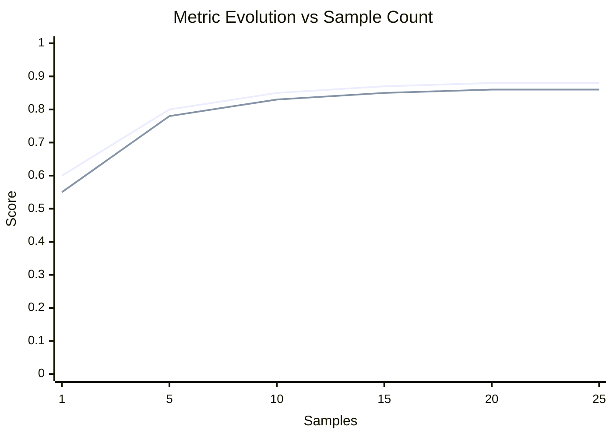

# agentme-edr-policy-028: AI eval standards

## Context and Problem Statement

Eval tests measure AI component accuracy against expected outputs using real LLM providers. Without a shared folder layout and script convention, eval setups diverge across LLM, Agent, and Workflow projects, making them hard to run, compare, and integrate into CI/CD pipelines.

How should eval tests be structured and run across all AI tiers?

## Decision Outcome

**Use a per-component folder structure under `evals/` with a standardized Makefile interface and MLflow-backed scripts, applicable to LLM, Agent, and Workflow components.**

For when evals are required per AI tier, see [agentme-edr-007](../principles/007-project-quality-standards.md) rule `09-ai-project-testing-requirements`.

### Details

#### 01-eval-folder-structure

Evals are grouped first by the component being evaluated, then by the specific evaluation scenario. Create one directory per component under `evals/`, and one directory per eval scenario inside it. Place `evals/` at the same level as `lib/` and `examples/`:

```text
evals/
  <component>/           # the component being evaluated (e.g., workflow-x, agent-y, model-z)
    eval-<name>/
      golden_dataset/    # EDR-024 + EDR-030 compliant golden dataset (README.md, dataset.schema.json, data/)
      eval.py            # evaluation script
      report-<type>.md   # generated report, one per evaluated test type (overwritten on each run — see rule 03)
      Makefile           # lint, eval, run, and eval-<type> targets
    eval-<name2>/
      ...
  <component2>/
    ...
```

`<component>` MUST match the name of the component under evaluation and use lowercase hyphen-separated words (e.g., `workflow-document-review`, `agent-support`, `model-classifier`).

`<name>` identifies the specific evaluation scenario using lowercase hyphen-separated words (e.g., `eval-basic`, `eval-complex`, `eval-edge-cases`). A scenario's `golden_dataset` MAY mix multiple test types across its entries: label each entry with its applicable `test_types` ([agentme-edr-030](030-ai-test-types-taxonomy.md) rule `04`) and use the `eval-<type>` targets below to run one type at a time.

The `golden_dataset/` subfolder MUST be a valid [agentme-edr-024](024-ml-dataset-structure.md) dataset (`README.md`, `dataset.schema.json`, one JSON file per entry under `data/` per rule `04-complex-structured-datasets-must-use-per-entry-json-files`, lint-validated per rule `06`) whose entries follow the golden dataset envelope defined in [agentme-edr-030](030-ai-test-types-taxonomy.md) rule `02`.

Each `evals/<component>/eval-<name>/Makefile` MUST declare a `TEST_TYPES` variable listing the `test_types` values present in its golden dataset, and define:

| Target | Behaviour |
|---|---|
| `lint` | Validates every `golden_dataset/data/*.json` file against `golden_dataset/dataset.schema.json` per [agentme-edr-024](024-ml-dataset-structure.md) rule `06` |
| `eval` | Depends on `lint`; runs `eval.py --type=all` with threshold enforcement; exits non-zero on failure (CI-safe) |
| `run` | Depends on `lint`; runs `eval.py --type=all` without threshold enforcement (exploration / debugging) |
| `eval-<type>` | Depends on `lint`; runs `eval.py --type=<type>` for one declared test type, following [agentme-edr-008](../devops/008-common-targets.md) rule `03`'s `eval-<qualifier>` convention |

```makefile
TEST_TYPES := smoke functional safety

lint:
	mise exec -- uv run --project . python lint_dataset.py golden_dataset/

eval: lint
	mise exec -- uv run --project . python eval.py --type=all

run: lint
	mise exec -- uv run --project . python eval.py --type=all --no-threshold

eval-%: lint
	mise exec -- uv run --project . python eval.py --type=$*
```

The module root Makefile MUST expose `make eval` and `make lint` targets that delegate to `eval` and `lint` respectively in every `evals/<component>/eval-<name>/Makefile`:

```makefile
eval:
	$(MAKE) -C evals/workflow-document-review/eval-basic eval
	$(MAKE) -C evals/workflow-document-review/eval-complex eval

lint:
	$(MAKE) -C evals/workflow-document-review/eval-basic lint
	$(MAKE) -C evals/workflow-document-review/eval-complex lint
```

#### 02-eval-script-requirements

Each `eval.py` script MUST:

- Load the golden dataset from `golden_dataset/` in the same eval folder, following [agentme-edr-024](024-ml-dataset-structure.md) and the entry envelope in [agentme-edr-030](030-ai-test-types-taxonomy.md) rule `02` (one JSON file per entry, `test_types` array, `input`, `expected_output`, optional `mock_fixtures`).
- Accept a required `--type=<test_type>|all` CLI argument and filter entries whose `test_types` array contains the requested value; `--type=all` includes every entry.
- Iterate **entry-first**: for each entry in the filtered set, invoke the real component exactly once; then score that single `actual_output` for every `test_types` value the entry carries that falls within the current `--type` scope — MUST NOT invoke the component more than once per entry per run.
- When an entry contains `mock_fixtures` ([agentme-edr-030](030-ai-test-types-taxonomy.md) rule `02`), configure each named mock adapter with its fixture data BEFORE invoking the component for that entry. Each entry MUST use fresh mock instances so fixture state does not bleed across entries. `mock_fixtures` applies to all test types including `human`. `mock_fixtures` MUST NOT configure LLM adapters — the LLM call MUST be real (see [agentme-edr-030](030-ai-test-types-taxonomy.md) rule `03`). How mock adapters are discovered and instantiated is left to the project; see [agentme-edr-026](026-pragmatic-hexagonal-architecture.md) rule `10` for the `_mock` file naming and placement convention.
- Run every component invocation against **real LLM providers** (not mocked responses), to capture model drift.
- For `human` entries: invoke the component to capture `actual_output`, export each entry's `input`, `expected_output.human_test` instructions, and `actual_output` into a manual-review checklist (`report-human.md`). MUST NOT invoke an automated scorer and MUST NOT enforce a pass/fail threshold for it. Other `test_types` on the same entry (e.g. `functional`) are still scored automatically.
- After all entries are processed, compute aggregate metrics per test type, log them to a local MLflow experiment (see rule `04`), write one `report-<type>.md` per evaluated test type (rule `03`), and exit with a non-zero status when any metric falls below its defined threshold per [agentme-edr-007](../principles/007-project-quality-standards.md) rule `07-statistical-models-must-have-eval-targets`. The `human` type has no threshold and does not trigger a non-zero exit.
- Compare outputs to expected values using project-defined quality thresholds per test type. Thresholds MUST be declared explicitly (e.g., in a Makefile variable or README) — this Policy does not mandate which test types a project must threshold or what value to use (see [agentme-edr-030](030-ai-test-types-taxonomy.md) rule `06`).

**Example:**

```python
import argparse
from collections import defaultdict
import mlflow
from my_package.app.workflows.document_review_workflow.graph import graph

EVAL_MIN_ACCURACY = {"functional": 0.85, "smoke": 0.85}

parser = argparse.ArgumentParser()
parser.add_argument("--type", required=True)
args = parser.parse_args()

entries = load_golden_dataset("golden_dataset/", test_type=args.type)  # "all" loads every entry
resolved_types = resolve_types(args.type, entries)

mlflow.set_experiment("document-review/eval-basic")

with mlflow.start_run():
    mlflow.set_tag("test_types", ",".join(sorted(resolved_types)))

    results = defaultdict(list)
    cumulative_metrics = defaultdict(lambda: {"accuracy": [], "f1": []})  # Track cumulative metrics

    # Entry-first loop: invoke each entry exactly once
    for idx, entry in enumerate(entries, start=1):
        # Configure mock adapters from mock_fixtures before invocation
        # (implementation left to the project — see agentme-edr-026 rule 10)
        if entry.get("mock_fixtures"):
            configure_mocks(entry["mock_fixtures"])  # project-defined helper

        actual_output = invoke_component(entry, graph)

        for test_type in [t for t in entry["test_types"] if t in resolved_types]:
            if test_type == "human":
                export_human_review(entry, actual_output)
                continue
            
            score_val = score(test_type, actual_output, entry["expected_output"])
            results[test_type].append(score_val)
            
            # Track cumulative metrics for convergence analysis
            cumulative_accuracy = sum(results[test_type]) / len(results[test_type])
            cumulative_f1 = compute_f1(results[test_type])  # project-defined
            cumulative_metrics[test_type]["accuracy"].append(cumulative_accuracy)
            cumulative_metrics[test_type]["f1"].append(cumulative_f1)

    # Aggregate, report, and enforce thresholds per test type
    for test_type in resolved_types:
        if test_type == "human":
            continue

        accuracy = sum(results[test_type]) / len(results[test_type])
        mlflow.log_metric(f"{test_type}_accuracy", accuracy)
        
        # Generate convergence analysis
        stability_window = min(10, len(results[test_type]))
        acc_change = abs(cumulative_metrics[test_type]["accuracy"][-1] - 
                        cumulative_metrics[test_type]["accuracy"][-stability_window])
        f1_change = abs(cumulative_metrics[test_type]["f1"][-1] - 
                       cumulative_metrics[test_type]["f1"][-stability_window])
        
        write_eval_report(
            test_type, 
            results[test_type], 
            cumulative_metrics=cumulative_metrics[test_type],
            stability_window=stability_window,
            thresholds={"accuracy": EVAL_MIN_ACCURACY[test_type]}
        )

        if accuracy < EVAL_MIN_ACCURACY[test_type]:
            raise SystemExit(f"Eval failed: {test_type} accuracy {accuracy:.2f} < {EVAL_MIN_ACCURACY[test_type]}")
```

#### 03-eval-report-file

Each eval script MUST produce one `report-<type>.md` per evaluated test type in the same `evals/<component>/eval-<name>/` folder and overwrite each on every run — only the types included in the current `--type` invocation are (re)written; report files for other types are left untouched. The `human` type does not produce a metrics report (see below).

**Generation constraint:** The report MUST be produced programmatically, reading raw metric values directly from MLflow. No LLM or generative model may write, summarize, or paraphrase any section of the report, to prevent hallucinated metric values. This constraint applies to all report sections including Overall Results, Convergence Analysis, and Per-item Results — all metric values and convergence chart data points MUST be computed from actual evaluation results.

The report MUST follow this template:

```markdown
# Eval Report: <name> — <type>

**Date:** <ISO date>
**Dataset:** golden_dataset/
**Script:** eval.py --type=<type>
**Thresholds:** accuracy ≥ <value>, F1 ≥ <value>

## Overall Results

| Metric    | Value  | 95% CI         | Threshold | Status  |
|-----------|--------|----------------|-----------|---------|
| Accuracy  | <val>  | [<low>, <high>]| ≥ <thr>   | ✓/✗ PASS/FAIL |
| F1 Score  | <val>  | —              | ≥ <thr>   | ✓/✗ PASS/FAIL |
| Precision | <val>  | —              | —         | —       |
| Recall    | <val>  | —              | —         | —       |
| Samples   | <n>    | —              | —         | —       |

**Overall: PASS / FAIL**

## Convergence Analysis

```mermaid
xychart-beta
  title "Metric Evolution vs Sample Count"
  x-axis "Samples" [<sample_points>]
  y-axis "Score" 0.0 --> 1.0
  line "Accuracy" [<accuracy_values>]
  line "F1 Score" [<f1_values>]
```

**Stability Analysis:**
- Accuracy change over last <window> samples: <change> percentage points
- F1 change over last <window> samples: <change> percentage points

**Recommendation:** <"Dataset appears sufficient for confident evaluation" | "Add more samples — metrics have not yet stabilized">

## Per-item Results

| ID  | Input Summary | Expected | Actual | Correct |
|-----|---------------|----------|--------|---------|  
| 001 | <summary>     | <label>  | <label>| ✓       |
| 002 | <summary>     | <label>  | <label>| ✗       |

## Notes

- <observations, failure patterns, MLflow run link>
```

**Confidence interval:** The 95% CI for accuracy MUST be computed using the **Wilson score interval** (preferred over the normal approximation for small $n$). A wide interval signals that the dataset is too small to support confident conclusions and the sample count should be increased.

The Wilson score bounds at 95% confidence ($z = 1.96$) are:

$$\frac{\hat{p} + \frac{z^2}{2n} \pm z\sqrt{\frac{\hat{p}(1-\hat{p})}{n} + \frac{z^2}{4n^2}}}{1 + \frac{z^2}{n}}$$

Where $\hat{p}$ is observed accuracy and $n$ is sample count. Accuracy and F1 are required; precision and recall are recommended.

**Convergence analysis:** The Convergence Analysis section shows whether adding more samples would likely change measured metrics. The section MUST include:

1. **Mermaid xychart-beta** showing cumulative Accuracy and F1 evolution:
   - X-axis: absolute cumulative sample count; Y-axis: metric value (0.0 to 1.0)
   - Two lines: Accuracy and F1
   - For datasets > 50 samples: sample at `floor(dataset_size / 10)` intervals (minimum 5), always include first and last points
   - For datasets ≤ 50 samples: show all points

2. **Stability analysis**: compute absolute change (percentage points) for both Accuracy and F1 over last `min(10, dataset_size)` samples. Example: Accuracy from 0.85 to 0.87 = 0.02 = 2 percentage points.

3. **Recommendation**:
   - Default threshold: both Accuracy AND F1 change ≤ 2 percentage points
   - If both meet threshold: "Dataset appears sufficient for confident evaluation"
   - If either exceeds: "Add more samples — metrics have not yet stabilized"
   - Projects MAY customize threshold (document in Makefile/README)

Exclude from `report-human.md` (no automated metrics).

**Filled-in example** (`evals/workflow-document-review/eval-basic/report-functional.md` for a document review workflow):

```markdown
# Eval Report: eval-basic — functional

**Date:** 2026-06-12
**Dataset:** golden_dataset/
**Script:** eval.py --type=functional
**Thresholds:** accuracy ≥ 0.85, F1 ≥ 0.80

## Overall Results

| Metric    | Value | 95% CI       | Threshold | Status      |
|-----------|-------|--------------|-----------|-------------|
| Accuracy  | 0.88  | [0.69, 0.97] | ≥ 0.85    | ✓ PASS      |
| F1 Score  | 0.86  | —            | ≥ 0.80    | ✓ PASS      |
| Precision | 0.89  | —            | —         | —           |
| Recall    | 0.84  | —            | —         | —           |
| Samples   | 25    | —            | —         | —           |

**Overall: PASS**

> Note: CI [0.69, 0.97] is wide — 25 samples may be insufficient for high confidence. Consider expanding the dataset.

## Convergence Analysis



**Stability Analysis:**
- Accuracy change over last 10 samples: 0.01 percentage points
- F1 change over last 10 samples: 0.01 percentage points

**Recommendation:** Dataset appears sufficient for confident evaluation

> Metrics stabilized after ~15 samples. Changes over last 10 samples are well below the 2 percentage point threshold.

## Per-item Results

| ID  | Input Summary                       | Expected | Actual   | Correct |
|-----|--------------------------------------|----------|----------|---------|
| 001 | Contract renewal, 3 pages, standard | approve  | approve  | ✓       |
| 002 | NDA with unusual liability clause   | escalate | escalate | ✓       |
| 003 | Vendor invoice, missing PO number   | reject   | reject   | ✓       |
| 004 | Employment agreement, standard terms| approve  | approve  | ✓       |
| 005 | Amendment with redlined IP clause   | escalate | approve  | ✗       |

## Notes

- Sample 005 misclassified: redlined IP clause not flagged as escalation trigger. Possible model drift.
- MLflow run: experiment `workflow-document-review/eval-basic`, tag `test_types=functional` — view with `mlflow ui`
```
```

**`human` type artifact:** instead of `report-human.md` with metrics, `--type=human` produces a checklist artifact (still named `report-human.md`) listing, per entry, its `input`, `expected_output.human_test` instructions, and the captured `actual_output` — with no Overall Results table, threshold, or PASS/FAIL section, since this type MUST NOT be auto-scored.

#### 04-eval-mlflow-unique-port

Each `evals/<component>/eval-<name>/Makefile` MUST start its MLflow tracking server on a **unique port** to prevent conflicts when multiple eval Makefiles are run concurrently or in parallel (e.g., in CI or across multiple terminal sessions).

Ports MUST be statically assigned per eval scenario (not per test type) and MUST NOT reuse the default `5000` port (reserved for `dev-mlflow` per [agentme-edr-008](../devops/008-common-targets.md) rule `09-ai-project-dev-targets`). Assign ports starting at `5100` and incrementing by 1 for each additional eval scenario across the entire project.

The MLflow **experiment** is scoped to the eval scenario: `<component>/<eval-name>` (e.g. `document-review/eval-basic`). Each `mlflow.start_run()` call MUST set a `test_types` tag listing the test types evaluated in that invocation (comma-separated, e.g. `"functional,smoke"` for `--type=all`, `"smoke"` for `--type=smoke`). A remote MLflow server MUST NOT be required — all tracking is local.

#### 05-llm-as-judge-binary-output

LLM judges scoring component outputs (functional evals, quality evaluations) MUST produce binary output: `0` (fail) or `1` (success).

**Requirements:**

- Judge prompts MUST instruct the model to output exactly `0` or `1`
- Scoring logic MUST parse the response and map to binary. Ambiguous/invalid responses: score as `0` or raise error
- Reports using LLM judges MUST use classification metrics (Accuracy, F1, Precision, Recall), not regression metrics (RMSE, R2, MAE)
- Multi-class classification not supported. For multiple quality levels, use multiple binary judges (e.g., one for "factually correct", another for "tone appropriate")

**Rationale:** Binary output makes LLM judges compatible with classification metrics infrastructure (Accuracy, F1, Wilson CI, convergence analysis).

**Example LLM judge prompt:**

```
Evaluate whether the document review decision is correct.

Input: {input_summary}
Expected: {expected_decision}
Actual: {actual_decision}

Output exactly "1" if the actual decision matches the expected decision and reasoning, or "0" if it does not.

Output:
```

## References

- [agentme-edr-007](../principles/007-project-quality-standards.md) — Project quality standards: when evals are required per AI tier (rule `09-ai-project-testing-requirements`) and statistical model eval targets (rule `07-statistical-models-must-have-eval-targets`)
- [agentme-edr-030](030-ai-test-types-taxonomy.md) — AI test types taxonomy: `test_types` enum, golden dataset entry envelope (including `mock_fixtures`), and mocking constraints per type
- [agentme-edr-026](026-pragmatic-hexagonal-architecture.md) — Rule `10`: `_mock` file naming and placement convention for mock adapters used in `mock_fixtures`
- [agentme-edr-018](018-ai-llm-development-standards.md) — LLM development standards: LangChain framework and observability
- [agentme-edr-019](019-ai-agents-development-standards.md) — Agent development standards
- [agentme-edr-021](021-ai-workflow-development-standards.md) — Workflow development standards
- [agentme-edr-024](024-ml-dataset-structure.md) — ML dataset structure, per-entry JSON format, and schema-lint validation for golden datasets
- [agentme-edr-008](../devops/008-common-targets.md) — `eval-<qualifier>` Makefile convention (rule `03`) and Mise tool-execution flow (rule `02`)
