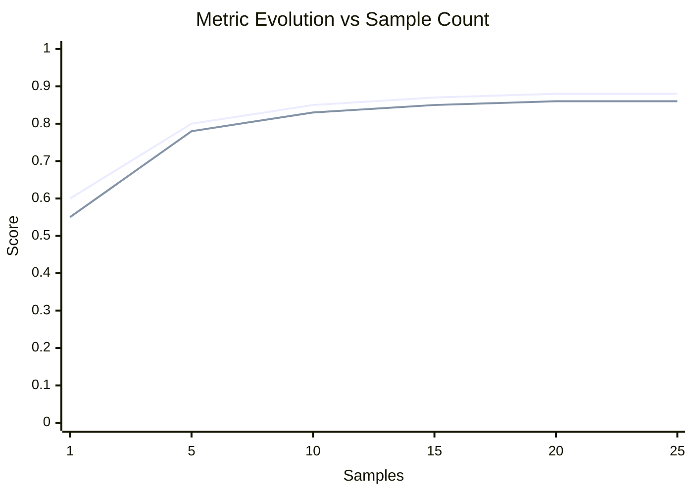

# agentme-edr-policy-054: AI eval report format

## Context and Problem Statement

Eval scripts produce output reports, but without a shared format these vary across projects: some omit confidence intervals, some skip convergence analysis, and some allow LLMs to write sections — making reports unreliable and non-comparable.

What format should eval reports follow, and what constraints apply to how they are generated?

## Decision Outcome

**Use a standardized `report-<type>.md` template with a Wilson score confidence interval, a Mermaid convergence chart, and a strict no-LLM generation constraint for all metric values.**

### Details

#### 01-eval-report-file

Each eval script MUST produce one `report-<type>.md` per evaluated test type in the same `evals/<component>/eval-<name>/` folder and overwrite each on every run — only the types included in the current `--type` invocation are (re)written; report files for other types are left untouched. The `human` type does not produce a metrics report (see below).

**Generation constraint:** The report MUST be produced programmatically, reading raw metric values directly from MLflow. No LLM or generative model may write, summarize, or paraphrase any section of the report, to prevent hallucinated metric values. This constraint applies to all report sections including Overall Results, Convergence Analysis, and Per-item Results — all metric values and convergence chart data points MUST be computed from actual evaluation results.

The report MUST follow this template:

```markdown
# Eval Report: <name> — <type>

**Date:** <ISO date>
**Dataset:** golden_dataset/
**Script:** eval.py --type=<type>
**Thresholds:** accuracy ≥ <value>, F1 ≥ <value>

## Overall Results

| Metric    | Value  | 95% CI         | Threshold | Status  |
|-----------|--------|----------------|-----------|---------|
| Accuracy  | <val>  | [<low>, <high>]| ≥ <thr>   | ✓/✗ PASS/FAIL |
| F1 Score  | <val>  | —              | ≥ <thr>   | ✓/✗ PASS/FAIL |
| Precision | <val>  | —              | —         | —       |
| Recall    | <val>  | —              | —         | —       |
| Samples   | <n>    | —              | —         | —       |

**Overall: PASS / FAIL**

## Convergence Analysis

```mermaid
xychart-beta
  title "Metric Evolution vs Sample Count"
  x-axis "Samples" [<sample_points>]
  y-axis "Score" 0.0 --> 1.0
  line "Accuracy" [<accuracy_values>]
  line "F1 Score" [<f1_values>]
```

**Stability Analysis:**
- Accuracy change over last <window> samples: <change> percentage points
- F1 change over last <window> samples: <change> percentage points

**Recommendation:** <"Dataset appears sufficient for confident evaluation" | "Add more samples — metrics have not yet stabilized">

## Per-item Results

| ID  | Input Summary | Expected | Actual | Correct |
|-----|---------------|----------|--------|---------|  
| 001 | <summary>     | <label>  | <label>| ✓       |
| 002 | <summary>     | <label>  | <label>| ✗       |

## Notes

- <observations, failure patterns, MLflow run link>
```

**Confidence interval:** The 95% CI for accuracy MUST be computed using the **Wilson score interval** (preferred over the normal approximation for small $n$). A wide interval signals that the dataset is too small to support confident conclusions and the sample count should be increased.

The Wilson score bounds at 95% confidence ($z = 1.96$) are:

$$\frac{\hat{p} + \frac{z^2}{2n} \pm z\sqrt{\frac{\hat{p}(1-\hat{p})}{n} + \frac{z^2}{4n^2}}}{1 + \frac{z^2}{n}}$$

Where $\hat{p}$ is observed accuracy and $n$ is sample count. Accuracy and F1 are required; precision and recall are recommended.

**Convergence analysis:** The Convergence Analysis section shows whether adding more samples would likely change measured metrics. The section MUST include:

1. **Mermaid xychart-beta** showing cumulative Accuracy and F1 evolution:
   - X-axis: absolute cumulative sample count; Y-axis: metric value (0.0 to 1.0)
   - Two lines: Accuracy and F1
   - For datasets > 50 samples: sample at `floor(dataset_size / 10)` intervals (minimum 5), always include first and last points
   - For datasets ≤ 50 samples: show all points

2. **Stability analysis**: compute absolute change (percentage points) for both Accuracy and F1 over last `min(10, dataset_size)` samples. Example: Accuracy from 0.85 to 0.87 = 0.02 = 2 percentage points.

3. **Recommendation**:
   - Default threshold: both Accuracy AND F1 change ≤ 2 percentage points
   - If both meet threshold: "Dataset appears sufficient for confident evaluation"
   - If either exceeds: "Add more samples — metrics have not yet stabilized"
   - Projects MAY customize threshold (document in Makefile/README)

Exclude from `report-human.md` (no automated metrics).

**Filled-in example** (`evals/workflow-document-review/eval-basic/report-functional.md` for a document review workflow):

```markdown
# Eval Report: eval-basic — functional

**Date:** 2026-06-12
**Dataset:** golden_dataset/
**Script:** eval.py --type=functional
**Thresholds:** accuracy ≥ 0.85, F1 ≥ 0.80

## Overall Results

| Metric    | Value | 95% CI       | Threshold | Status      |
|-----------|-------|--------------|-----------|-------------|
| Accuracy  | 0.88  | [0.69, 0.97] | ≥ 0.85    | ✓ PASS      |
| F1 Score  | 0.86  | —            | ≥ 0.80    | ✓ PASS      |
| Precision | 0.89  | —            | —         | —           |
| Recall    | 0.84  | —            | —         | —           |
| Samples   | 25    | —            | —         | —           |

**Overall: PASS**

> Note: CI [0.69, 0.97] is wide — 25 samples may be insufficient for high confidence. Consider expanding the dataset.

## Convergence Analysis



**Stability Analysis:**
- Accuracy change over last 10 samples: 0.01 percentage points
- F1 change over last 10 samples: 0.01 percentage points

**Recommendation:** Dataset appears sufficient for confident evaluation

> Metrics stabilized after ~15 samples. Changes over last 10 samples are well below the 2 percentage point threshold.

## Per-item Results

| ID  | Input Summary                       | Expected | Actual   | Correct |
|-----|--------------------------------------|----------|----------|---------|
| 001 | Contract renewal, 3 pages, standard | approve  | approve  | ✓       |
| 002 | NDA with unusual liability clause   | escalate | escalate | ✓       |
| 003 | Vendor invoice, missing PO number   | reject   | reject   | ✓       |
| 004 | Employment agreement, standard terms| approve  | approve  | ✓       |
| 005 | Amendment with redlined IP clause   | escalate | approve  | ✗       |

## Notes

- Sample 005 misclassified: redlined IP clause not flagged as escalation trigger. Possible model drift.
- MLflow run: experiment `workflow-document-review/eval-basic`, tag `test_types=functional` — view with `mlflow ui`
```
```

**`human` type artifact:** instead of `report-human.md` with metrics, `--type=human` produces a checklist artifact (still named `report-human.md`) listing, per entry, its `input`, `expected_output.human_test` instructions, and the captured `actual_output` — with no Overall Results table, threshold, or PASS/FAIL section, since this type MUST NOT be auto-scored.

## References

- [agentme-edr-053](053-ai-eval-script.md) — AI eval script: the script that produces these reports (rule `01`)
- [agentme-edr-055](055-ai-eval-repeatability.md) — AI eval repeatability: rule `02` defines the adapted report shape for `report-repeatability.md`
- [agentme-edr-051](051-ai-eval-core-standards.md) — AI eval core standards: folder structure (rule `01`) and LLM-as-judge binary scoring (rule `02`)
